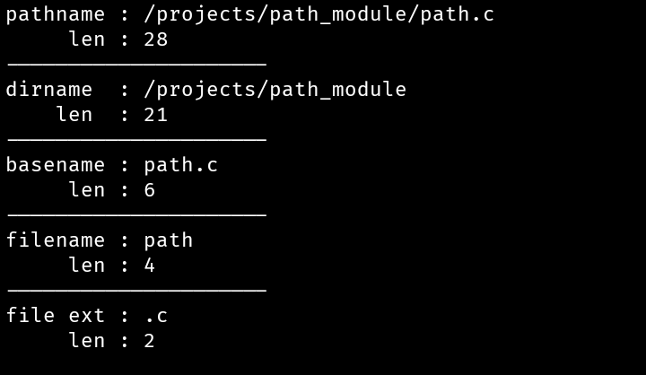

# Path Module For C
**Simple and lightweight pathname parser for C without any external dependencies. This module helps to parse dirname, basename, filename, file extension along with their length**

## Building
Just place `path.c` and `path.h` then include the header file on your project and compile it later with your project.

## API
There are only 3 functions. one for parsing, one for freeing memory and one for printing the path struct.

```c
// path structure
struct Path {
    char *dirname;
    char *basename;
    char *filename;
    char *file_ext;
    size_t dirname_len;
    size_t basename_len;
    size_t filename_len;
    size_t file_ext_len;
};

struct Path path_parse(const char *pathname);
void path_free_mem(struct Path *path);
void path_dbgln(const char *pathname, struct Path *path);
```

## Example
There is also a test file in _src_ dir where you can see example.

```c
// main.c

#include "path.h"

int main(void)
{
    const char *pathname = "/projects/path_module/path.c";

    struct Path path = path_parse(pathname);
    path_dbgln(pathname, &path);
    path_free_mem(&path);
}

```
Output: 
