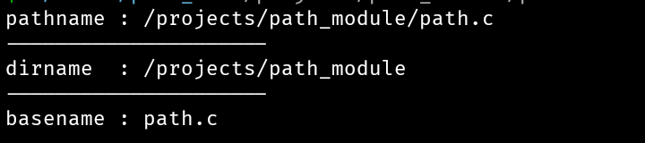

# Path Module For C
File name and extension parsing functionality are removed because it's difficult to distinguish between a hidden dir **(ex: .git)** and filename. Their code are not completely removed only commented. So if still you want use that functionality uncomment and use it.

## Building
If you want to use this on your project just place `path.c` and `path.h` then compile it along with your project. But if you want test it before using it on your project clone this repo and their is a `Makefile` from where you can compile the source and test file together.
* clone this repo
   ```bash
   git clone https://github.com/PrajwalCH/path_module
   cd path_module
   ```
* Compile it by running `make` or for debug build `make DEBUG=1`

## API
There are only 2 functions. one for parsing and one for debug printing the path structure.

```c
// path structure
struct Path {
    char *dirname;
    char *basename;
    size_t dirname_len;
    size_t basename_len;
};

struct Path path_parse(char *pathname);
void path_dbgln(char *pathname, struct Path *path);
```

## Examples
There is also a test file in _src_ dir where you can see example.

```c
// main.c

#include "path.h"

int main(void)
{
    char *pathname = "/projects/path_module/path.c";

    struct Path path = path_parse(pathname);
    path_dbgln(pathname, &path);
}

```
Output: 

If you want to print or copy individual parts by yourself..
```c
int main(void)
{
    char *pathname = "/projects/path_module/path.c";

    struct Path path = path_parse(pathname);

    // there is no need to use length while printing for basename but it's recommend to use if want to copy on another buffer for safe.

    printf("dirname: %.*s\n", (int)path.dirname_len, path.dirname);
    printf("basename: %s\n", path.basename);

    // copy to another buffer
    char dirname[path.dirname_len + 1];
    memset(dirname, 0, sizeof(dirname));

    memcpy(dirname, path.dirname, path.dirname_len);
    printf("your dirname: %s\n", dirname);
}
```
